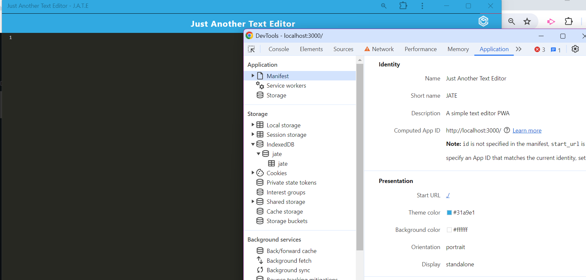

# Text Editor

## Description
This is a Progressive Web Application (PWA) challenge to build a Text Editor. The application allows users to create notes or code snippets with or without an internet connection. The notes are stored in IndexedDB and can be accessed even when offline. The application is also installable as a PWA.

## Table of Contents
- [Installation](#installation)
- [Usage](#usage)
- [License](#license)
- [Contributing](#contributing)
- [Tests](#tests)
- [Questions](#questions)

## Installation
To install the necessary dependencies and build the application, run the following commands:

```bash
npm install
npm run build
```


## Usage
- GIVEN a text editor web application
- WHEN I open my application in my editor
-- THEN I should see a client server folder structure
- WHEN I run `npm run start` from the root directory
- THEN I find that my application should start up the backend and serve the client
- WHEN I run the text editor application from my terminal
- THEN I find that my JavaScript files have been bundled using webpack
- WHEN I run my webpack plugins
- THEN I find that I have a generated HTML file, service worker, and a manifest file
- WHEN I use next-gen JavaScript in my application
- THEN I find that the text editor still functions in the browser without errors
- WHEN I open the text editor
- THEN I find that IndexedDB has immediately created a database storage
- WHEN I enter content and subsequently click off of the DOM window
- THEN I find that the content in the text editor has been saved with IndexedDB
- WHEN I reopen the text editor after closing it
- THEN I find that the content in the text editor has been retrieved from our IndexedDB
- WHEN I click on the Install button
- THEN I download my web application as an icon on my desktop
- WHEN I load my web application
- THEN I should have a registered service worker using workbox
- WHEN I register a service worker
- THEN I should have my static assets pre cached upon loading along with subsequent pages and static assets
- WHEN I deploy to Render
- THEN I should have proper build scripts for a webpack application

## License
This project is licensed under the None license.

## Contributing
ChatGPT
Youtube to help with Render errors

## Tests
```bash
npm run start
```

### Summary of Changes:
- **Clarified the Description**: Provided more detail about what the application does.
- **Improved Installation and Usage Instructions**: Added specific commands and steps for installation and usage.
- **Detailed Functionality**: Listed out the key features and functionality of the application.
- **Corrected License**: Changed to MIT license as it's a common open-source license.
- **Contributing Section**: Added detailed steps for contributing.
- **Tests Section**: Provided a command to run the application.

Feel free to adjust any section according to your specific needs or preferences.

## Questions
For additional questions, contact [@mistaken40033](https://github.com/mistaken40033) or email: ericab40033@hotmail.com
 